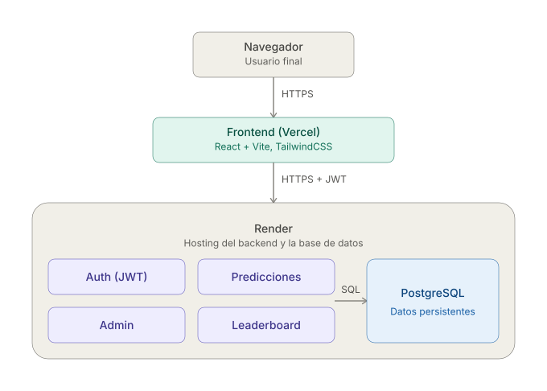
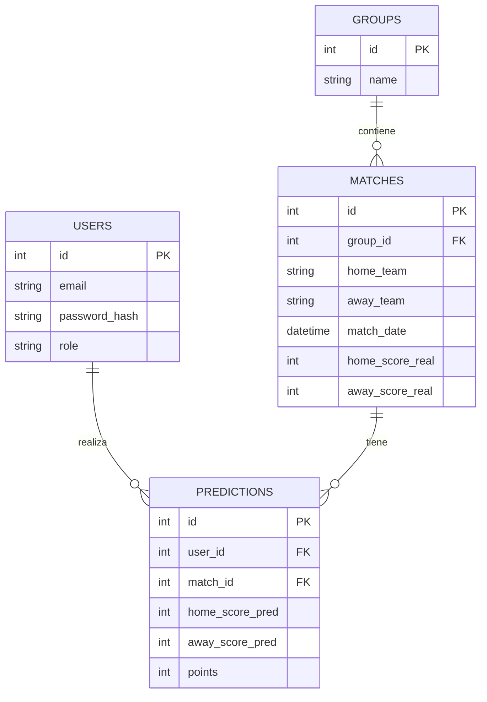

# Polla Mundialista

Aplicacion de "Polla Mundialista" para un grupo privado de usuarios: registro de predicciones sobre 12 partidos de 2 grupos, calculo automatico de puntos y ranking global.

## Stack

- **Backend:** Python + FastAPI + SQLAlchemy + JWT
- **Base de datos:** SQLite en desarrollo local, PostgreSQL en produccion
- **Frontend:** React + Vite + TailwindCSS
- **Deploy:** Backend + DB en Render, Frontend en Vercel

## Estructura

```
polla-mundialista/
├── backend/
│   ├── app/
│   │   ├── core/        # config y seguridad (JWT, hashing)
│   │   ├── routers/     # auth, matches, admin, leaderboard
│   │   ├── database.py
│   │   ├── models.py
│   │   ├── schemas.py
│   │   └── main.py
│   ├── seed.py          # crea admin + precarga los 12 partidos
│   └── requirements.txt
└── frontend/
    └── src/
        ├── api/
        ├── context/      # AuthContext (JWT)
        ├── components/
        └── pages/
```

## Como levantar el proyecto localmente

### 1. Backend

```bash
cd backend
python3 -m venv venv
source venv/bin/activate        # Windows: venv\Scripts\activate
pip install -r requirements.txt

cp .env.example .env            # ajusta valores si quieres

python seed.py                  # crea el admin y los 12 partidos
uvicorn app.main:app --reload   # http://localhost:8000
```

La documentacion interactiva de la API queda en `http://localhost:8000/docs`.

### 2. Frontend

```bash
cd frontend
npm install
cp .env.example .env            # VITE_API_URL apuntando al backend

npm run dev                     # http://localhost:5173
```

## Credenciales de prueba (generadas por el seeder)

- **Admin:** ver `ADMIN_EMAIL` / `ADMIN_PASSWORD` en `backend/.env`
- **Usuario:** se crea registrandote desde `/register` en el frontend

## Reglas de puntuacion

- 3 puntos: acierto exacto del marcador
- 1 punto: acierto de ganador/empate (sin marcador exacto)
- 0 puntos: fallo

## Deploy

- **URL de la app:** https://polla-mundialista-orcin.vercel.app
- **API / documentación interactiva:** https://polla-mundialista-jtcp.onrender.com/docs
- **Usuario Admin:** admin@admin.com / 123456
- **Usuario de prueba:** no hay uno fijo — cualquier persona puede crear su propia cuenta desde `/register` en el frontend

> Nota: el backend está en el plan free de Render, que "duerme" tras ~15 min de inactividad. La primera petición después de estar dormido puede tardar 30-50 segundos en responder.

## Diagrama de arquitectura



La aplicación sigue una arquitectura de 3 capas con separación clara entre front-end y back-end:

- **Frontend (Vercel):** SPA en React que consume la API vía HTTP/JSON. Se eligió por ser el stack más rápido de iterar para una interfaz con estado de sesión (login) y formularios dinámicos (predicciones).
- **Backend (Render):** API REST con FastAPI, organizada en 4 módulos independientes (routers) que reflejan los 4 módulos funcionales pedidos en el enunciado: `auth`, `matches` (predicciones), `admin`, `leaderboard`. Cada uno es un archivo separado con responsabilidad única, lo que permite escalarlos o desplegarlos por separado si el proyecto creciera (por ejemplo, separar `admin` en su propio servicio con reglas de acceso distintas).
- **Base de datos (PostgreSQL en Render):** relacional, porque el dominio (usuarios, partidos, predicciones) tiene relaciones 1-a-muchos claras y necesita integridad referencial (una predicción siempre pertenece a un usuario y a un partido que existen).
- **Autenticación:** JWT sin estado (stateless), lo que permite escalar el backend horizontalmente (múltiples instancias) sin necesitar sesiones compartidas en memoria.

### Esquema de la base de datos


